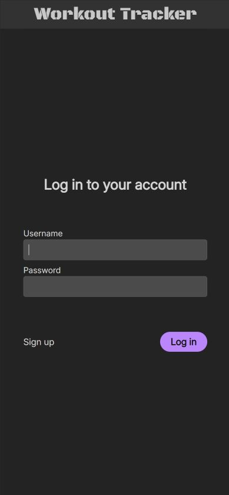
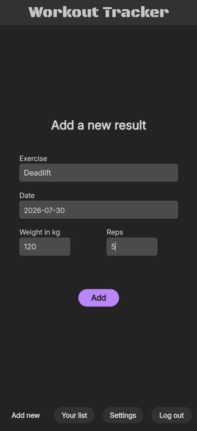
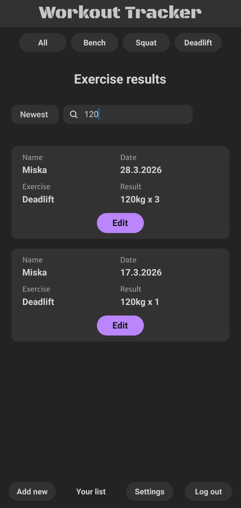
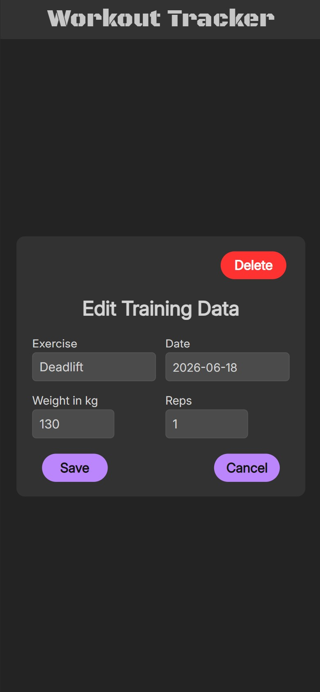
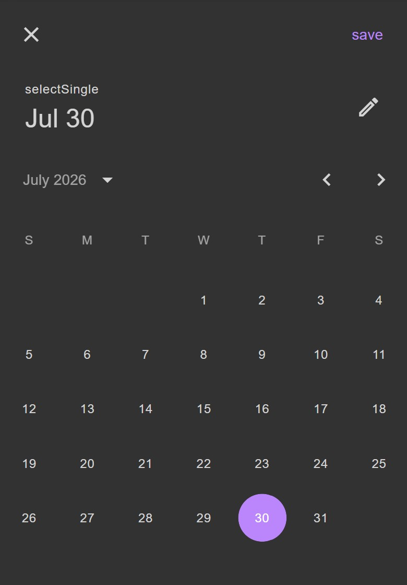
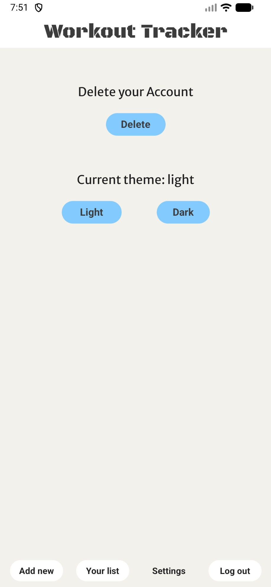
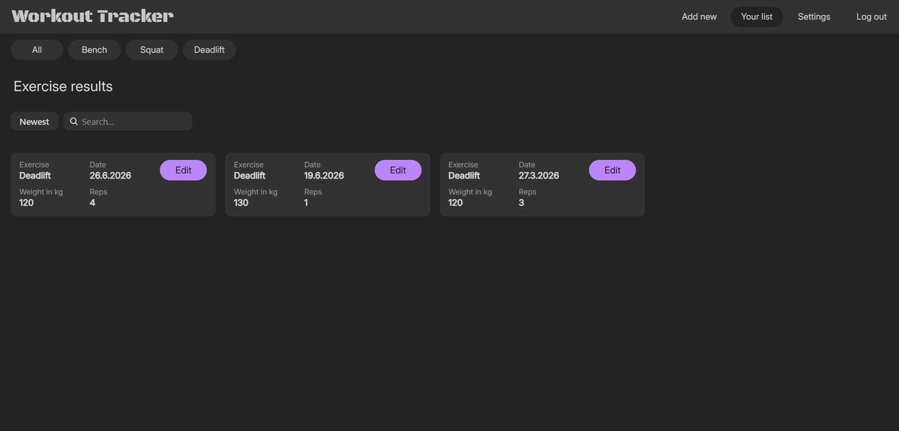

# Workout Tracker

## About

Responsive mobile first application to track personal workout results.

## Docker deployment

Docker Compose starts PostgreSQL, the Express API, and the Expo web build together. Docker Desktop is the only prerequisite.

1. Copy `.env.example` to `.env` and set `POSTGRES_PASSWORD` to a strong value.
2. Build and start the stack:

   ```bash
   docker compose up --build -d
   ```

3. Open the web application at http://localhost:8080.

Useful maintenance commands:

```bash
docker compose ps
docker compose logs -f backend
docker compose pull
docker compose up --build -d
docker compose down
```

PostgreSQL data is stored in the `postgres_data` volume. The schema is applied automatically when the volume is created for the first time. `docker compose down -v` also removes the database volume and all stored workout data.

The frontend API URL is baked into the Expo web bundle at build time using `EXPO_PUBLIC_API_URL`. For a remote deployment, set it to the public API URL in `.env` before rebuilding. For Expo Go or a physical mobile device, set the same variable to an address reachable from that device, for example `http://192.168.1.10:3001`.

## Local development

1. Start PostgreSQL and apply `backend/database/schema.sql`.
2. Set `POSTGRES_HOST`, `POSTGRES_DB`, `POSTGRES_USER`, and `POSTGRES_PASSWORD` for the backend if your local database does not use the defaults.
3. In `backend`, run `npm install`, `npm run build`, and `npm start` (or `npm run dev` during development).
4. In `frontend`, run `npm install` and `npm run web`, or start Expo Go.

## Using Workout Tracker

First time users need to create an account before logging in, which is quick and simple, no email verification required. The username must be at least 4 characters long, and the password at least 10. Once logged in, the app will remember your session until you log out.



Users can add workout results by filling out the form.



Use the search, sort, and workout tabs to quickly find specific workouts.



Exercise results can be easily edited and removed.



Select the date from a responsive calendar component.



Switch between light and dark themes in the settings menu.



Also fully responsive in the browser.



## Future updates

UI/UX improvements, Charts to visually track progress. More workout customization options.

## Tech stack

React Native, TypeScript, React Query, Node.js, Express, PostgreSQL, Jest.
